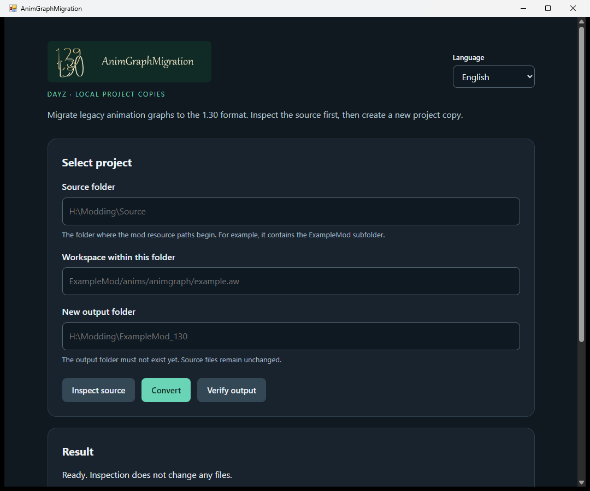

# AnimGraphMigration

[English](README.md) | [Deutsch](README.de.md)

AnimGraphMigration konvertiert unterstützte ältere DayZ-AnimGraphs samt Workspace, Template und Instanz in das untersuchte Format von DayZ 1.30. **Die Graphkonvertierung ist modunabhängig:** Entscheidend sind die verwendeten Dateikonstrukte. Der Konverter arbeitet mit Kopien und schreibt ausschließlich in einen neuen Ausgabeordner.

## Windows-Programm herunterladen

**[AnimGraphMigration 1.1.0 für Windows x64 herunterladen](https://github.com/weltvolk/AnimGraphMigration/releases/download/v1.1.0/AnimGraphMigration-1.1.0-Windows-x64.zip)**

1. Die ZIP vollständig entpacken, zum Beispiel nach `H:\Tools\AnimGraphMigration`.
2. **`AnimGraphMigration.exe`** im entpackten Hauptordner doppelt anklicken. Die EXE öffnet ein eigenes Desktopfenster.
3. Die Anwendung startet auf **Englisch**. Bei Bedarf **Deutsch** oder **Čeština** auswählen.

Die Anwendung ist portabel; ein Installationsassistent oder eine separate Node.js-Installation ist nicht erforderlich. Die ZIP enthält die benötigte Node.js-Laufzeit samt Lizenz. Alle entpackten Dateien und Ordner müssen zusammenbleiben; die EXE allein reicht nicht aus. Das Desktopfenster benötigt .NET Framework 4.6.2 oder neuer und die Microsoft Edge WebView2 Evergreen Runtime. Fehlt sie, zeigt der Starter einen Hinweis zum Bezug; er installiert sie nicht automatisch. Node.js läuft im Hintergrund. Das Schließen des Anwendungsfensters beendet auch dessen lokalen Dienst.

Die [Release-Seite v1.1.0](https://github.com/weltvolk/AnimGraphMigration/releases/tag/v1.1.0) enthält die Veröffentlichung. GitHubs **Source code**-Archive enthalten den Quellcode; für das fertige Windows-Programm den oben verlinkten ZIP-Download verwenden. DayZ Tools, Spieldaten und Moddateien sind nicht enthalten.



## Unterstützter Umfang

| Bereich | Unterstützung |
|---|---|
| Graphformat | Ausdrücklich unterstützter Ausschnitt von Legacy-`$AnimGraph 7`. |
| Node-Typen | `AnimNodeStateMachine`, `AnimNodeSource`, `AnimNodeSwitch` mit den dokumentierten Feldern und Flags. |
| Ressourcen | Legacy-`.aw`, `.agr`, `.asi` und passende `.ast`; konsistente Verweise und Ressourcenmetadaten. |
| Templates und Instanzen | Legacy-AST mit genau einem unbenannten Gruppentyp; Legacy-ASI ohne Vererbung. Bekannte native Templates sind ebenfalls möglich. |
| Modelle und Animationsclips | Unveränderte Kopien. Keine Modell-, Skeleton-, TXA- oder ANM-Konvertierung. |
| Unbekannte Konstrukte | Abbruch mit Fehlermeldung, statt Felder stillschweigend wegzulassen. |

Das Werkzeug ist für Projekte verschiedener Mods gedacht, sofern sie diese Konstrukte verwenden. **Eine pauschale Kompatibilität mit allen Mods wird nicht behauptet.** Weitere Nodes, nicht implementierte Felder oder mehrdeutige Referenzen benötigen eine gezielte Erweiterung. Die vollständigen Regeln stehen in [Formatunterstützung](docs/format-support.md).

**Status: begrenzte Formatunterstützung.** Die Ausgabe orientiert sich an untersuchten Dateien der DayZ Experimental Workbench **1.30.164014.27**. Eine erfolgreiche Konvertierung und Integritätsprüfung bestätigt die unterstützte Dateiabbildung, nicht das gesamte Spielverhalten. Jede eigene Mod benötigt anschließend ihre Editor- und Spieltests; andere Toolbuilds benötigen ebenfalls eine gesonderte Prüfung.

## Voraussetzungen

- Entpackte, editierbare Quelldateien; das Werkzeug entpackt keine PBOs.
- Ein Projekt-Root mit den virtuellen Modpfaden. Für `ExampleMod/anims/example.aw` muss `<root>/ExampleMod/anims/example.aw` existieren.
- Alle direkt referenzierten Graph-, Template-, Instanz-, Clip- und Preview-Model-Dateien innerhalb dieses Roots. Fehlende direkte Abhängigkeiten führen zum Abbruch.
- Ein neuer, noch nicht vorhandener Ausgabeordner außerhalb des Eingabeordners.
- Für die anschließende Editorprüfung: passende DayZ 1.30 Tools und Spieldaten.
- Nur bei einem Quellcode-Checkout: **Node.js 22 oder neuer** installieren. Zusätzliche npm-Pakete sind nicht nötig.

Verwende den kleinsten vollständigen Projektordner mit den benötigten Ressourcen. Weitere Abhängigkeiten innerhalb von Binärmodellen oder der Engine löst der Konverter nicht auf.

## Desktopoberfläche verwenden

1. `AnimGraphMigration.exe` starten.
2. Den vollständigen **Quellordner** eintragen, etwa `H:\DayZProjects\MyModLegacy`.
3. Den **Workspace innerhalb dieses Ordners** angeben, etwa `ExampleMod/anims/example.aw`.
4. Einen **neuen Zielordner** eintragen, etwa `H:\DayZProjects\MyMod130`.
5. **Quelle prüfen**, dann **Konvertieren** und anschließend **Ziel prüfen** wählen. Unter **Prüfbericht anzeigen** stehen die Details.

Die Oberfläche verarbeitet lokale Dateien und lädt keine Moddateien ins Internet. Zum Beenden das Desktopfenster schließen; dadurch wird auch der Hintergrunddienst beendet.

Die allgemeine CLI bietet zusätzlich `serve` für die Oberfläche im Browser. Im Quellcode-Checkout `node bin/animgraph-migration-general.mjs serve` ausführen und die vollständige lokale Adresse aus dem Terminal öffnen. Dieses Terminal geöffnet lassen und zum Beenden `Strg+C` drücken. Beim direkten Aufruf von `serve` öffnet `--open` den Browser automatisch.

## Kommandozeile

Im Hauptordner des portablen Pakets:

```powershell
.\runtime\node\node.exe .\app\bin\animgraph-migration-general.mjs inspect --root "H:\DayZProjects\MyModLegacy" --workspace "ExampleMod/anims/example.aw"
.\runtime\node\node.exe .\app\bin\animgraph-migration-general.mjs convert --root "H:\DayZProjects\MyModLegacy" --workspace "ExampleMod/anims/example.aw" --output "H:\DayZProjects\MyMod130"
.\runtime\node\node.exe .\app\bin\animgraph-migration-general.mjs verify --root "H:\DayZProjects\MyMod130"
```

Alternativ im Quellcode-Checkout mit installiertem Node.js:

```powershell
node bin/animgraph-migration-general.mjs inspect --root "H:\DayZProjects\MyModLegacy" --workspace "ExampleMod/anims/example.aw"
node bin/animgraph-migration-general.mjs convert --root "H:\DayZProjects\MyModLegacy" --workspace "ExampleMod/anims/example.aw" --output "H:\DayZProjects\MyMod130"
node bin/animgraph-migration-general.mjs verify --root "H:\DayZProjects\MyMod130"
node bin/animgraph-migration-general.mjs serve --open
```

| Befehl | Wirkung |
|---|---|
| `inspect --root DIR --workspace PATH` | Ausgewählten Workspace und seine Abhängigkeiten prüfen, ohne eine Konvertierung zu schreiben. |
| `convert --root DIR --workspace PATH --output NEW_DIR` | Projekt in einen neuen Ordner kopieren und die unterstützten Ressourcen konvertieren. |
| `verify --root CONVERTED_DIR` | Erzeugte Ausgabe gegen Manifest und Ressourcenreferenzen prüfen. |
| `serve [--port 0] [--open]` | Lokale Browseroberfläche starten; Port `0` lässt einen freien Port wählen. |

Berichte liegen im Ausgabeordner unter `.animgraph-migration/report.json` und `.animgraph-migration/manifest.json`. Die Quelle wird vor und nach der Konvertierung per Prüfsumme verglichen. Exitcode `0` bedeutet Erfolg, `1` einen Prüf- oder Konvertierungsfehler und `2` einen fehlerhaften CLI-Aufruf.

Konvertiert wird der Dateisatz des ausgewählten Workspaces. Weitere Legacy-Dateien im Projekt werden lediglich kopiert. Der aktive alte Hauptgraph wird in der Ausgabe durch eine neue `.agf` ersetzt; der ursprüngliche Eingabeordner bleibt erhalten.

## Prüfung der eigenen Mod

1. `verify` ausführen und Bericht sichern.
2. Eine gesonderte Prüfkopie der Ausgabe in der passenden Workbench öffnen. Kopierte `.gproj`-Dateien bleiben unverändert: absolute Mountpfade vorher auf die Prüfkopie umstellen. Quelle und Ausgabe wegen möglicher gleicher Ressourcenidentitäten nicht gleichzeitig mounten.
3. `.aw` und `.agr` öffnen; exakte Fehlermeldungen, Console Log und Toolbuild dokumentieren.
4. States, Übergänge, Bedingungen, Switch-Werte und Clipzuweisungen gegen die Quelle prüfen. Zuweisungszahlen vor und nach einem nativen Speichern vergleichen und den gespeicherten Stand erneut öffnen.
5. Preview Model, Skeleton, Bone-Namen, Materialien und sichtbare Clipwiedergabe prüfen.
6. Die eigene Mod in einem isolierten Spieltest prüfen, einschließlich Übergängen, Root Motion, Bodenbewegung und relevanter Script-/Bone-Abfragen. Bei Client/Server-Tests auf denselben tatsächlich geladenen Paketstand achten.

Editor-Speicheraktionen verändern das geprüfte Ausgabemanifest. Deshalb erfolgen sie in einer separaten Prüfkopie. Die [Validierungsanleitung](docs/validation.md) erläutert die Aussagegrenzen.

Der Konverter erzeugt keine PBOs, führt keinen Workbench-Import aus und veröffentlicht nichts im Workshop. Modelle, Skeletons und Animationsclips bleiben Kopien ihrer Eingaben; ihre Laufzeitkompatibilität wird nicht automatisch bestätigt.

## Entwicklung und Fehlerberichte

Im Quellcode-Checkout:

```powershell
npm test
```

Die Tests verwenden synthetische Fixtures und benötigen keine privaten Mod- oder Spieldateien. Fehlerberichte sollten Toolversion, Node-Version, Betriebssystem, Befehl und exakte Fehlermeldung enthalten. Für neue Konstrukte helfen ein minimales künstliches Eingabebeispiel und die erwartete Editorausgabe. Persönliche Pfade entfernen und nur Dateien teilen, die veröffentlicht werden dürfen.

## Lizenz

Eigener Werkzeugcode und öffentliche Dokumentation stehen unter der [MIT-Lizenz](LICENSE). Die mitgelieferte Node.js-Laufzeit behält ihre beigefügten Lizenztexte. DayZ, Bohemia Interactive und Modautoren behalten ihre Rechte an ihren Produkten und Inhalten. Die Repository-Lizenz erteilt keine Rechte an verarbeiteten Mod- oder Spieldateien. AnimGraphMigration ist ein unabhängiges Werkzeug und keine offizielle Veröffentlichung von Bohemia Interactive.
