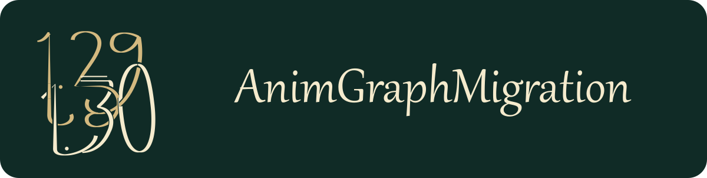

# AnimGraphMigration

AnimGraphMigration bereitet ältere DayZ-Animationsprojekte für das Animationsformat von DayZ 1.30 Experimental vor. Der Konverter liest einen entpackten Projektordner, übernimmt ihn in einen **neuen Ausgabeordner** und konvertiert die unterstützten Graph-, Template-, Instanz- und Workspace-Dateien gemeinsam. Ein ausdrücklich gewähltes Blackbird-2.08-Profil ergänzt die Vorbereitung von zwölf Bewegungsclips und die Prüfung ihres anschließenden nativen Imports.

Das Projekt entstand aus einer Untersuchung mit der DayZ Experimental Workbench **1.30.164014.27**. Graphkonvertierung und TXA-Vorbereitung erfolgen direkt aus den Quelldateien. Die neuen ANMs des Blackbird-Profils müssen in dieser Workbench tatsächlich importiert werden; das Werkzeug erzeugt sie nicht selbst und bietet keinen automatisierten Workbench-Aufruf an.

**Status:** experimentelles Werkzeug mit bestandener begrenzter Produktsichtabnahme unter **1.30.164014.27**. Der vollständige Ablauf wurde mit echtem Workbench-Import durchgeführt: zwölf Kandidaten und zwölf Originalkontrollen neu importiert, alle zwölf Kandidaten geprüft und eine finale Ausgabe erstellt. GUI-Aktionen, Integritätsprüfung und der anschließende aufgezeichnete Spieltest dieser Ausgabe bestanden. Die Nutzerbewertung des abschließenden Tests lautet **„absolut glatt, weder zuckler noch ruckler“**.

Die zwölf vorbereiteten TXAs stimmen bytegenau mit den zuvor privat getesteten Kandidaten überein; für den Boden liegt außerdem die Nutzerbewertung **„boden super“** vor. Das zuvor schnelle horizontale Zittern ließ sich durch den Aktualisierungszeitpunkt der nachgeführten Testkamera beseitigen, während alle zwölf korrigierten Animationsassets gleich blieben. Der Konverter erzeugt keine Änderung an Produktionskamera oder Modskripten. Der abschließend neu finalisierte Bestand ist in seinen 168 Laufzeitdateien bytegleich mit dem getesteten Paket. Die Abnahme gilt für den beobachteten Ablauf und den festen Build; sie bestätigt keine Workbench-Modellvorschau oder allgemeine Fehlerfreiheit anderer Projekte. Das Werkzeug veröffentlicht keine Mods und startet keine Workshop-Aktion.

## Voraussetzungen

- Node.js **22 oder neuer**.
- Entpackte, editierbare Quelldateien. Das Werkzeug entpackt keine PBOs und importiert keine Modelle.
- Ein Projekt-Root, unter dem Ressourcen mit ihrem virtuellen Modpfad erreichbar sind. Für `ExampleMod/anims/bird.aw` muss beispielsweise `<root>/ExampleMod/anims/bird.aw` existieren.
- Alle direkt verwendeten Graph-, Template-, Instanz-, Clip- und Preview-Model-Dateien müssen innerhalb dieses Roots vorhanden sein. Fehlende direkte Abhängigkeiten führen zum Abbruch.
- Ein neuer, noch nicht vorhandener Ausgabeordner außerhalb des Eingabeordners.
- Für das optionale Blackbird-Profil: der vollständig passende Originalbestand mit 37 aktiven ANM-/TXA-Paaren, Experimental Workbench **1.30.164014.27**, eine passende `.gproj`-Vorlage, die nutzereigene Skeleton-Registry und passende Experimental-Spieldaten. Einzelheiten stehen im [Blackbird-Ablauf](docs/blackbird-profile.md).

Es werden keine zusätzlichen npm-Pakete benötigt. Alle folgenden Beispiele arbeiten auf `H:`.

## Start mit Oberfläche

Unter Windows `Start-AnimGraphMigration.cmd` doppelt anklicken. Das Programm startet eine deutsche Oberfläche im Browser. Node.js 22 oder neuer muss installiert und als `node` verfügbar sein. Alternativ im Repository-Ordner starten:

```powershell
npm run gui
```

Die im Programmfenster angezeigte vollständige lokale Adresse öffnen, falls der Browser nicht automatisch erscheint. Das Programmfenster während der Bearbeitung geöffnet lassen.

1. **Quellordner:** den vollständigen Pfad zum entpackten Projekt eingeben, etwa `H:\DayZProjects\BirdLegacy`.
2. **Workspace innerhalb dieses Ordners:** den virtuellen Pfad angeben, etwa `ExampleMod/anims/bird.aw`.
3. **Neuer Zielordner:** einen noch nicht vorhandenen Ordner auswählen, etwa `H:\DayZProjects\Bird130`.
4. Unter **Animationsdateien** die normale Graphkonvertierung beibehalten oder ausdrücklich **Blackbird 2.08 – zwölf Bewegungsclips vorbereiten** wählen.
5. Mit **Quelle prüfen** die Eingabe kontrollieren, mit **Konvertieren** die neue Projektkopie erstellen und mit **Ziel prüfen** ihre Integrität kontrollieren. Details stehen unter **Prüfbericht anzeigen**.

Beim Blackbird-Profil ist diese erste Ausgabe eine Vorbereitung mit alten ANM-Platzhaltern. Danach im Abschnitt **Native Bewegungsclips importieren** eine gesonderte Importkopie erstellen, dort den tatsächlichen Workbench-Import durchführen, **Editorimport prüfen** und eine dritte, **geprüfte Ausgabe** erstellen. Die vollständigen Schritte und benötigten Vorlagen beschreibt [Blackbird-Profil](docs/blackbird-profile.md). Erst die finalisierte Ausgabe ist für den isolierten Spieltest vorgesehen.

Die Oberfläche verarbeitet die Dateien auf diesem Rechner und überträgt keine Moddateien ins Internet. Zum Beenden im Programmfenster `Strg+C` drücken.

## Kommandozeile

Repository herunterladen oder klonen, dann im Repository-Ordner ausführen:

```powershell
npm test
npm start -- inspect --root "H:\DayZProjects\BirdLegacy" --workspace "ExampleMod/anims/bird.aw"
npm start -- convert --root "H:\DayZProjects\BirdLegacy" --workspace "ExampleMod/anims/bird.aw" --output "H:\DayZProjects\Bird130"
npm start -- verify --root "H:\DayZProjects\Bird130"
```

`inspect` analysiert die ausgewählte Workspace-Abhängigkeit, ohne eine Konvertierung zu schreiben. `convert` kopiert den Eingabe-Root in den neuen Ausgabeordner und erzeugt die neuen Ressourcen. `verify` kontrolliert die erzeugte Ausgabe. Nicht unterstützte oder widersprüchliche Eingaben führen zu einer verständlichen Fehlermeldung; sie werden nicht stillschweigend weggelassen.

Der maschinenlesbare Bericht liegt unter `.animgraph-migration/report.json`, das Prüfsummenverzeichnis unter `.animgraph-migration/manifest.json` im Ausgabeordner. Die Quelle wird vor und nach der Konvertierung per Prüfsumme verglichen. Exitcode `0` bedeutet Erfolg, `1` einen Prüf- oder Konvertierungsfehler und `2` einen fehlerhaften CLI-Aufruf.

Das Blackbird-Profil wird bei `inspect` und `convert` mit `--asset-profile blackbird-2.08-motion-v1` gewählt. Es ist kein automatischer Standard. Seine drei getrennten Ausgabestände entstehen so:

| Schritt | Befehl und Ergebnis |
|---|---|
| Vorbereiten | `convert` mit Profil und neuem `--output`: Graphen und zwölf korrigierte TXAs, native ANMs noch ausstehend. |
| Importkopie | `prepare-import --root PREPARED --output IMPORT_WORK --project-template TEMPLATE.gproj --skeleton-definitions SKELETONS.anim.xml --game-root EXPERIMENTAL_DATA`: separate Arbeitskopie für den manuellen Editorimport. |
| Prüfen und finalisieren | `verify-import --root PREPARED --import-root IMPORT_WORK`, danach `finalize-import --root PREPARED --import-root IMPORT_WORK --output VERIFIED`: neue Ausgabe mit geprüften ANMs und korrigierten TXAs. |

`PREPARED`, `IMPORT_WORK` und `VERIFIED` bezeichnen verschiedene Ordner. Vollständige kopierbare CLI-Beispiele und die erforderliche Aktion zwischen Vorbereitung und Prüfung stehen in [Blackbird-Profil](docs/blackbird-profile.md).

Konvertiert wird der Dateisatz des ausgewählten Workspaces. Weitere, nicht davon verwendete Legacy-Dateien werden lediglich kopiert. Der alte Hauptgraph wird im aktiven Dateisatz durch die neue `.agf` ersetzt; der ursprüngliche Eingabeordner bleibt erhalten.

Verwende als Root den kleinsten vollständigen Projektordner mit den direkt benötigten Ressourcen. Ein vollständiger Steam- oder Workshop-Ordner ist dafür nicht erforderlich. Weitere von Modellen oder der Engine benötigte Vanilla-Ressourcen müssen anschließend in der Workbench über die passenden Spieldaten verfügbar sein; der Konverter untersucht deren binäre Abhängigkeiten nicht.

## Was wird konvertiert?

| Quelldatei | Ausgabe und Behandlung |
|---|---|
| Legacy-Workspace `.aw` | Workspace mit aufeinander abgestimmten Graph-, Template-, Instanz- und Preview-Verweisen. |
| Legacy-Graph `.agr` | Native Graphdefinition `.agr` und Graphinhalte `.agf`. |
| Animation-Set-Template `.ast` | Benannte Gruppen und Spalten im neuen Templateformat. |
| Animation-Set-Instanz `.asi` | Qualifizierte Animationszuweisungen im Format `Gruppe.Spalte.Animation`. |
| Ressourcen-Metadaten `.meta` | Konsistente Ressourcenidentitäten für die erzeugten Dateien. |
| TXAs beim ausdrücklich gewählten Blackbird-Profil | Zwölf nachgewiesene Bewegungsquellen werden angepasst; 25 weitere aktive Clips bleiben unverändert. |
| ANMs beim Blackbird-Profil | Zunächst unveränderte Platzhalter; nach externem Workbench-Import übernimmt `finalize-import` ausschließlich geprüfte Kandidaten in eine neue Ausgabe. |
| Modelle, sonstige Clips, Texturen und andere Projektdateien | Kopie der Quelldateien; keine Bone-Umbenennung und kein Modellimport. |

Der genaue unterstützte Umfang und die Abbruchbedingungen stehen in [Formatunterstützung](docs/format-support.md). Das Verfahren lässt sich ohne echte Mod- oder Spieldateien über synthetische Testfälle prüfen.

## Prüfung in der Workbench

1. Ausgabe in einem getrennten Projekt mit passenden DayZ Experimental Tools und Spieldaten prüfen. Bei normaler Graphkonvertierung bleiben kopierte `.gproj`-Dateien unverändert: Vor dem Öffnen deren absolute Mountpfade kontrollieren und auf die Kopie umstellen. Für das Blackbird-Profil erzeugt `prepare-import` eine gesonderte Projektdatei mit isolierten Mounts. Alte Quelle und neue Ausgabe wegen möglicher gleicher Ressourcenidentitäten nicht gleichzeitig als Roots mounten.
2. Die ausgegebene `.aw` und `.agr` öffnen. Console Log und Fehlermeldungen sichern.
3. States, Übergänge, Bedingungen und Clipzuweisungen kontrollieren. Vor dem ersten Speichern die Zahl der Instanzzuweisungen festhalten und danach erneut vergleichen.
4. Preview Model, Skeleton, Materialien und sichtbare Clipwiedergabe prüfen. Beim Blackbird-Profil erst nach erfolgreicher nativer Importprüfung und Finalisierung den getrennten Spieltest durchführen.

Workbench-Speicheraktionen gehören in eine eigene Prüfkopie: Die manifestierte Vorbereitung bleibt unverändert. Im ausgewiesenen Importordner dürfen nur die vorgesehenen Kandidaten/Kontrollen neu importiert werden; zusätzliche Änderungen führen zum Abbruch der Importprüfung.

Die frühere Editoruntersuchung zeigte, dass ungültige flache ASI-Zuweisungen beim nativen Speichern verloren gehen können. Deshalb behandelt dieses Werkzeug Template, Instanz, Graph und Ressourcenidentitäten als zusammenhängenden Dateisatz. Der genaue Prüfablauf und seine Grenzen stehen in [Validierung](docs/validation.md).

## Entwicklung und Fehlerberichte

```powershell
npm test
```

Die Tests verwenden ausschließlich synthetische Fixtures. Für einen Fehlerbericht genügen Toolversion, Node-Version, Betriebssystem, ausgeführter Befehl und die Fehlermeldung. Wenn ein minimales Beispiel nötig ist, persönliche Pfade entfernen und nur Dateien beifügen, die veröffentlicht werden dürfen. Originale Modbestände und Spieldaten gehören nicht in öffentliche Issues.

## Lizenz

Der neu entwickelte Werkzeugcode und die öffentliche Dokumentation stehen unter der [MIT-Lizenz](LICENSE). DayZ, Bohemia Interactive und Modautoren behalten ihre Rechte an ihren jeweiligen Produkten und Inhalten. Die Lizenz dieses Repositories erteilt keine Rechte an verarbeiteten Mod- oder Spieldateien. Dieses Projekt ist ein unabhängiges Werkzeug und keine offizielle Veröffentlichung von Bohemia Interactive.
